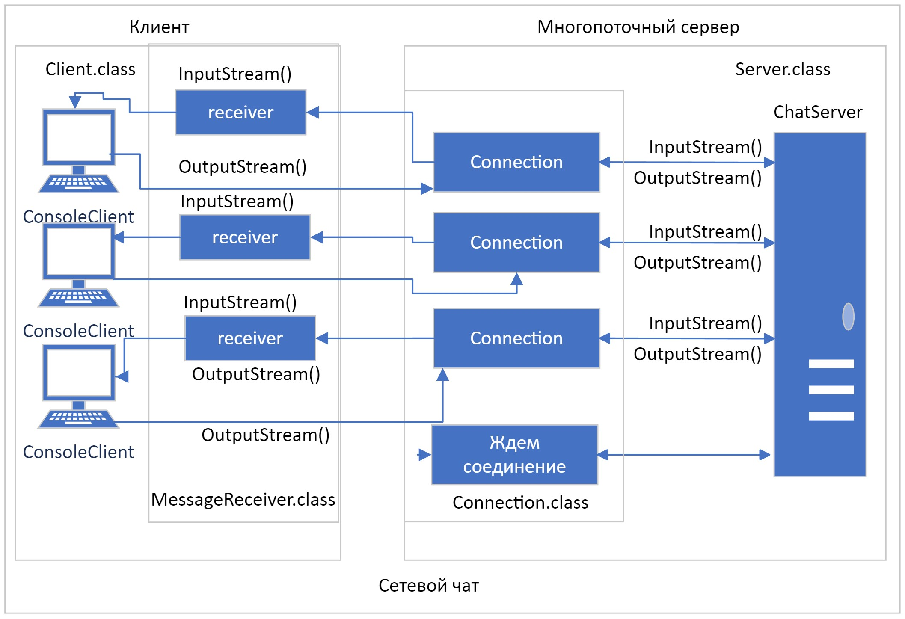

# Многопоточный "Сетевой чат"
___
## Описание
___
Многопоточный "Сетевой чат" демонстрирует работу Клиент Серверной архитектуры, обеспечивая возможность обмена 
простыми текстовыми сообщениями между клиентом и сервером. Ввод и вывод сообщений осуществляется
с помощью консоли.

## Описание сервера.
___
Приложение рассчитано на работу в локальной сети. Взаимодействия между клиентом и 
сервером реализовано по протоколу TCP, через классы ServerSocket и Socket из пакета java.net.  

После старта, Server создает ServerSocket, ожидающий новое подключение. Успешное подключение к ServerSocket создает
соединение Connection.class выделенное в одельный поток, обслуживающий непрерывный обмен между ServerSocket и Socket.
После соединения, Server ожидает нового подключения.

Все активные соединения добавляются в `List<Connection>`.
Для инициализации ChatServer необходимо три аргумента InetAddress, int serverPort, Logger.
Server служит оберткой для инициализации ChatServer, Logger через ServerSetting.

### Сервер (ChatServer.class) имеет возможности:

- Обслуживать до 50 одновременных соединений.
- Запускаться с разными параметрами.
- Получать сообщения от клиентов.
- Отправлять сообщения всем подключенным клиентам, в консоль.
- Создавать соединения в отдельном потоке.
- Запускаться на разных портах.
- Записывать события и сообщения в файл log.txt.
- Оповещать клиентов о вошедших и ушедших участниках чата.
- Запрашивать и отображать имя участника.
- Проверять уникальность выбранных имен.
- Отключать клиентов после отправки сообщения exit.

## Описание Клиента.
___
Клиент для сервера выполнен в отдельном модуле. После инициализации ConsoleClient, создает Socket для связи с 
созданным ServerSocket на стороне сервера. Если сервер запущен, с аналогичными параметрами InetAddress и serverPort 
будет установлено соединение. 

После соединения экземпляр BufferedReader передается в качестве аргумента, 
экземпляру MessageReceiver. MessageReceiver запускается в параллельном потоке и служит для получения информации от
ServerSocket и вывода ее в консоль, до обрыва соединения или ввода сообщения exit со стороны клиента. 

### Клиент(ConsoleClient.class) имеет возможности:

- Подключатся к серверу ChatServer.
- Запускаться с разными параметрами.
- Видеть сообщения от всех участников чата с момента подключения.
- Отправлять сообщения в чат.
- Запускаться на разных портах.
- Записывать события и сообщения в файл log.txt.
- Осуществлять прием и отправку сообщений через консоль.
- Отключатся от сервера после отправки сообщения exit.

## Класс настроек клиента(ClientSetting.class) и сервера(ServerSetting.class.
___
Класс настроек позволяет получать параметры хранящиеся в setting.properties и с помощью методов, получать 
их значения.
* ipAddress=localhost - IP адрес для сервера и клиента.
* port=2020 - порт для обмена сообщениями.
* logPath=./src/main/java/net/chat/resources/log.txt - путь дя хранения лог файла.

## Модуль Logger.
___
Модуль Logger состоит из одного публичного метода log, который принимает аргумент типа 
String для записи в файл log.txt, по указанному пути при инициализации экземпляра.

Модуль нужен для обеспечения логирования событий и сообщений на сервере и клиенте. Logger принимается в качестве 
аргумента при инициализации ChatServer и ConsoleClient, в классах Server и Client.

## Схема приложения
___
